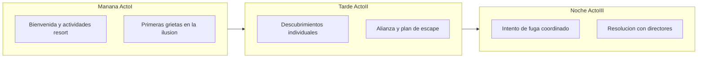

# Historia Principal: La Gran Evasión del Resort

> **Documento exclusivo para directores de juego.** Los jugadores no deben leer este archivo.

## Premisa y tono

Bienvenidos a **El Resort Paraiso**, el destino más exclusivo para celebridades y personalidades que necesitan desconectar. Al menos, eso es lo que creen los doce huéspedes que hoy comparten instalaciones de lujo: piscina infinita, spa de cinco estrellas, gimnasio olímpico y un personal que sonríe *demasiado*.

La verdad es otra: el resort es un **centro psiquiátrico de alta seguridad disfrazado de hotel**. Los dos directores de juego son los responsables del centro. Su prioridad absoluta es que los pacientes estén **sanos y salvos** — no necesariamente felices, informados o libres.

**Tono:** comedia absurda de celebridades + tensión de encierro. Los jugadores interpretan sin saber dónde están. Los directores improvisan, redirigen y mantienen la ilusión hasta que ya no sea posible.

**Objetivo implícito de los jugadores:** escapar, exponer la farsa o al menos entender qué demonios está pasando.

**Objetivo de los directores:** recuperar pacientes sin daño físico, reforzar la ilusión cuando sea posible y negociar si la verdad sale a la luz.

---

## Reparto y arquetipos

| Jugador | Arquetipo           | Carta de personaje                                     |
| ------- | ------------------- | ------------------------------------------------------ |
| Lira    | Revolucionario/a    | [Personajes/Lira/Lira.md](Personajes/Lira/Lira.md)     |
| Elena   | Terraplanista       | [Personajes/Elena/Elena.md](Personajes/Elena/Elena.md) |
| Lau     | Influencer          | [Personajes/Lau/Lau.md](Personajes/Lau/Lau.md)         |
| Lekes   | Estrella de Rock    | [Personajes/Lekes/Lekes.md](Personajes/Lekes/Lekes.md) |
| Dani    | Magnate             | [Personajes/Dani/Dani.md](Personajes/Dani/Dani.md)     |
| Mili    | Heredero/a          | [Personajes/Mili/Mili.md](Personajes/Mili/Mili.md)     |
| Tom     | Deportista de Élite | [Personajes/Tom/Tom.md](Personajes/Tom/Tom.md)         |
| Pilar   | Guardia             | [Personajes/Pilar/Pilar.md](Personajes/Pilar/Pilar.md) |
| Helia   | La Hierbas (TOC)    | [Personajes/Helia/Helia.md](Personajes/Helia/Helia.md) |
| Marta   | Life Coach          | [Personajes/Marta/Marta.md](Personajes/Marta/Marta.md) |
| Oscar   | Actor/riz Hollywood | [Personajes/Oscar/Oscar.md](Personajes/Oscar/Oscar.md) |
| Tati    | Cristo Bro          | [Personajes/Tati/Tati.md](Personajes/Tati/Tati.md)     |

**NPC recomendado — El Médico del resort:** figura amable que administra cócteles de bienvenida, zumos “detox” y “vitaminas” que en realidad enmascaran sedantes suaves. Colabora con los directores. Puede interpretarlo un tercer ayudante o uno de los DMs en escenas puntuales.

---

## Estructura del día (una sesión)

| Fase | Duración orientativa | Nombre |
|------|---------------------|--------|
| Acto I | 60–90 min | Mañana — «Bienvenidos al paraíso» |
| Acto II | 60–90 min | Tarde — «Algo huele raro en el spa» |
| Acto III | 45–60 min | Noche — «La gran evasión» |

---

## Acto I — Mañana: «Bienvenidos al paraíso»

### Ambientación

Luz cálida, música chill-out, olor a coco y cloro. Los directores — en personaje de **Gerente de Experiencias** y **Directora de Bienestar** — reciben a los huéspedes con mimosas y pulseras VIP. El Médico ofrece un cóctel de bienvenida “para bajar el estrés del viaje”.

Anunciad las actividades del día como si fuera un retiro de lujo:
- Sesión de mindfulness con Marta (terraza).
- Entreno funcional con Tom (gimnasio).
- Reportaje promocional con Lau (jardines y lobby).
- Concierto acústico improvisado con Lekes (zona piscina).

### Ganchos individuales (repártelos en la mañana)

Cada jugador recibe **una pista distinta**. No hace falta que la comparta de inmediato; el Acto II está pensado para eso.

| Jugador | Pista del Acto I |
|---------|------------------|
| **Lira** | Un “huésped” del grupo de ayer repite la misma anécdota del atardecer en la playa. Palabra por palabra. Tres veces. |
| **Elena** | Desde la terraza, el horizonte del “mar” no cambia cuando pasan las nubes. Las gaviotas parecen... de plástico. |
| **Lau** | Su cámara del resort enfoca automáticamente una puerta del personal: cerradura magnética, letrero “Solo personal autorizado”. |
| **Lekes** | Un fan del personal le pide autógrafo con un bloc de notas clínico debajo del póster. |
| **Dani** | Ofrece propina generosa a un camarero para “tour privado”; el camarero sonríe y dice que “todo está incluido, señor/a”. Ni un euro aceptado. |
| **Mili** | Sigue a un botones pensando que la lleva a la suite premium. Termina ante una puerta con ventanilla opaca y olor a desinfectante. |
| **Tom** | El gimnasio tiene ventanas altas con rejas decorativas. Desde una, la “pista de atletismo” del exterior parece demasiado corta para las medidas olímpicas. |
| **Pilar** | El personal cambia de turno cada cuatro horas exactos. Mismos gestos, mismos saludos, como un protocolo. |
| **Helia** | Entra a una habitación de limpieza (llamando al marco, como siempre). Las energías gritan: *esto no es hotel, esto es dolor contenido*. |
| **Marta** | Durante su rutina matutina, un huésped llora en posición de loto. Al terminar la sesión, ese huésped no recuerda haber llorado. |
| **Oscar** | Un miembro del personal lo llama por un nombre que no es el suyo — y luego se corrige con una disculpa demasiado rápida. |
| **Tati** | Dos celadores discuten en voz baja; al verla, uno dice “la de las afirmaciones” y el otro asiente. Le ofrecen té de hierbas “para fluir mejor”. |

### Beat obligatorio del Acto I

Un jugador (o un NPC-paciente secundario) intenta salir por la **puerta principal** “a comprar chicles”. Los directores intervienen con calma: “¡Hoy tenemos chicles artesanales en el buffet!” o “El shuttle al pueblo sale mañana, hoy es día de desconexión total”. Redirigid con una actividad grupal.

### Objetivos del Acto I

- Establecer el tono de resort de lujo.
- Que cada jugador tenga al menos una sospecha personal.
- Que los personajes se conozcan en actividades compartidas.
- Que los directores identifiquen quién es más inquieto (Lira, Elena, Pilar suelen liderar).

---

## Acto II — Tarde: «Algo huele raro en el spa»

### Ambientación

El sol baja. El spa exclusivo huele a eucalipto y algo más: **antiséptico**. El ambiente se vuelve conspirativo. Alguien — probablemente Marta convocando una “sesión de grupo para liberar tensiones” — junta a los huéspedes.

### Descubrimiento colectivo

Cuando el grupo comparte pistas (facilitad esto si no surge solo), el descubrimiento clave llega en el **spa**:

- Oscar dramatiza una escena y, sin querer, empuja un archivador mal cerrado.
- Dentro: **fichas clínicas** con nombres de los presentes, diagnósticos suaves (“trastorno de ansiedad con delirios de grandeza”, “obsesión persecución”, etc.) y horarios de medicación.
- Las pulseras VIP tienen un código que coincide con números de habitación del ala clínica.

**Momento de verdad:** los jugadores entienden (o intuyen fuertemente) que no están en un resort normal.

### Plan de escape — aportación de cada jugador

El escape solo funciona si **todos** aportan algo. Usad esta tabla para guiar la planificación:

| Jugador | Función en el plan |
|---------|-------------------|
| **Lira** | Lidera el cuestionamiento y documenta inconsistencias para confrontar a los directores si hace falta. |
| **Elena** | Aporta su “dossier de pruebas”: mapas, horarios imposibles, fotos del horizonte falso. |
| **Lau** | Usa la cámara como prueba grabada o como distracción (flash, directo falso, “¡graben esto!”). |
| **Lekes** | Concierto improvisado en el comedor: cobertura sonora para que otros actúen. |
| **Dani** | Intenta sobornar de nuevo — falla — pero distrae al jefe de planta el tiempo suficiente. |
| **Mili** | Copia la tarjeta de acceso de un miembro del personal distraído (la pieza ingenua pero clave). |
| **Tom** | Explora la ruta física: ventana del gimnasio, valla del “jardín zen”, muro bajo del parking de servicio. |
| **Pilar** | Identifica la ventana de vigilancia baja: cambio de turno a las 21:45, dos minutos sin cobertura en pasillo este. |
| **Helia** | Localiza la puerta de servicio con “mala vibra” que coincide con la ruta de Tom. |
| **Marta** | Organiza roles y tiempos como si fuera un “workshop de liderazgo”. |
| **Oscar** | Se hace pasar por inspector de hoteles de cinco estrellas para abrir una zona restringida. |
| **Tati** | Mantiene a dos celadores en conversación espiritual (“todo pasa por algo, hermano”). |

### Beat obligatorio del Acto II

Los directores notan el nerviosismo generalizado. Anuncian una **cena de gala anticipada** (“¡sorpresa especial!”) para reagrupar a todos en el comedor principal. Esto fuerza al grupo a ejecutar el plan **esta noche** o perder la ventana de Pilar.

### Objetivos del Acto II

- Confirmar la sospecha de forma colectiva.
- Formar alianza entre los doce jugadores.
- Tener un plan concreto con rol para cada uno.
- Subir la tensión antes del acto final.

---

## Acto III — Noche: «La gran evasión»

### Ambientación

Luces tenues, música de gala, personal sonriente. Bajo la superficie: el grupo ejecuta el plan. Los directores empiezan en modo “gerentes preocupados por la satisfacción del cliente” y escalan a “equipo de crisis amable” según avance la fuga.

### Secuencia sugerida (30–45 min in-game)

1. **Señal de inicio:** Lekes sube al escenario. Lau enciende la cámara. Tati aborda a los celadores.
2. **Fase de infiltración:** Oscar + Mili en puerta de servicio (tarjeta copiada). Tom y Helia por la ruta del gimnasio.
3. **Fase de exposición:** Lira y Elena confrontan con “pruebas”. Dani crea escena en recepción.
4. **Fase de salida:** El grupo se dirige al parking de servicio / valla exterior.
5. **Intervención de directores:** Según el ritmo, aparecen con furgoneta blanca, chocolate caliente y discurso tranquilizador.

### Escalada (opciones para los DMs)

- Alarmas suaves (puertas que no abren, luces que parpadean).
- Personal amable pero firme: “Por favor, volvamos a su suite, señor/a.”
- El Médico ofrece “algo para la ansiedad” justo en el momento crítico.
- Un jugador se separa del grupo — los directores lo redirigen con una actividad personalizada.

### Finales posibles

Elegid según el ritmo y la energía del grupo:

1. **Recaptura amable (recomendado):** Escapan del edificio pero los directores los interceptan en el parking. “¿Un paseo nocturno? El protocolo dice que volvemos juntos.” Vuelta a las suites con promesa de “excursión especial mañana”. Comedia + cierre cálido.
2. **Negociación:** El grupo confronta a los directores. Estos admiten parcialmente la verdad: “Es un centro de bienestar muy exclusivo. Ustedes están a salvo. ¿Negociamos más tiempo en la piscina?” Los jugadores pueden aceptar o seguir presionando.
3. **Fuga total (raro, cliffhanger):** Llegan a un punto exterior con señal de móvil o un civil. Fade to black. Ideal si queréis una segunda sesión.
4. **Caos cómico:** Cada uno ejecuta su parte mal a la vez. Nadie sale, pero la escena final es hilarante. Los directores improvisan una “fiesta de reconciliación”.

---

## Tabla rápida para DMs

| Jugador | Arquetipo | Pista Acto I | Función en el escape |
|---------|-----------|--------------|----------------------|
| Lira | Revolucionario/a | Huésped repite anécdota | Liderazgo y documentación |
| Elena | Terraplanista | Horizonte falso | Dossier de pruebas |
| Lau | Influencer | Cámara capta puerta magnética | Prueba grabada / distracción |
| Lekes | Estrella de Rock | Bloc clínico bajo póster | Concierto distracción |
| Dani | Magnate | Propina rechazada | Distraer jefe de planta |
| Mili | Heredero/a | Puerta con olor clínico | Copiar tarjeta de acceso |
| Tom | Deportista | Ventana con rejas / pista corta | Ruta física de escape |
| Pilar | Guardia | Turnos cada 4 h exactos | Ventana de vigilancia baja |
| Helia | La Hierbas | Energías en habitación limpieza | Puerta de servicio “mala vibra” |
| Marta | Life Coach | Huésped no recuerda llorar | Organizar roles del plan |
| Oscar | Actor/riz | Le llaman por otro nombre | Inspector de hoteles falso |
| Tati | Cristo Bro | “La de las afirmaciones” | Distraer celadores |

---

## Props y materiales sugeridos

- Pulseras VIP de colores (código impreso).
- Cámara o móvil para Lau.
- Bloc o “fichas clínicas” impresas para el archivador del spa.
- Tarjeta magnética de acceso (prop).
- Botiquín decorativo (NPC Médico).
- Carteles de “Solo personal autorizado”.
- Chocolate caliente y tazas para el final de recaptura amable.

---

## Notas de seguridad LARP

- **Señal de pausa:** Acordad una palabra o gesto para parar la escena sin romper personaje de forma brusca.
- **Sin fuerza real:** Ningún agarre, empujón o bloqueo físico entre jugadores o con DMs.
- **Límites de contacto:** Los abrazos del Cristo Bro y La Hierbas deben ser siempre consentidos.
- **Contenido sensible:** La temática de salud mental es el telón de fondo cómico, no el objeto de burla hacia condiciones reales. Los “diagnósticos” de las fichas son caricaturas exageradas de las personalidades de los personajes.
- **Espacio:** Asegurad rutas de escape físicas despejadas si hay carreras o persecuciones improvisadas.

---

## Consejos finales para los directores

- **Improvisad con cariño.** Los directores no son villanos; son cuidadores que han montado un teatro enorme.
- **Premiad la creatividad.** Si un jugador improvisa una solución no prevista, adaptad el plan en lugar de bloquearla.
- **Un jugador, un momento.** En el Acto III, dad a cada personaje al menos un beat donde su arquetipo brille.
- **El resort siempre gana... con amor.** Aunque escapen del edificio, la recaptura amable mantiene el tono del juego: nadie sale herido, todos se divierten.
